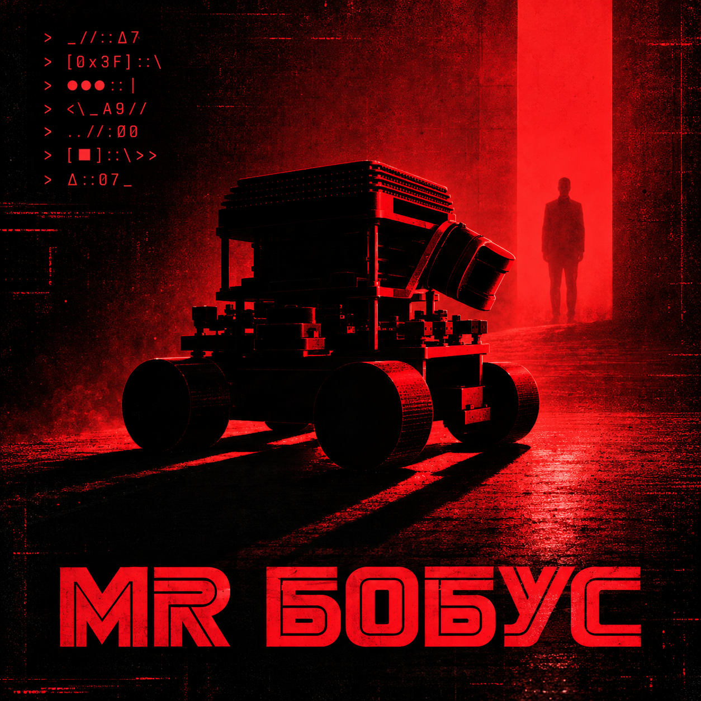
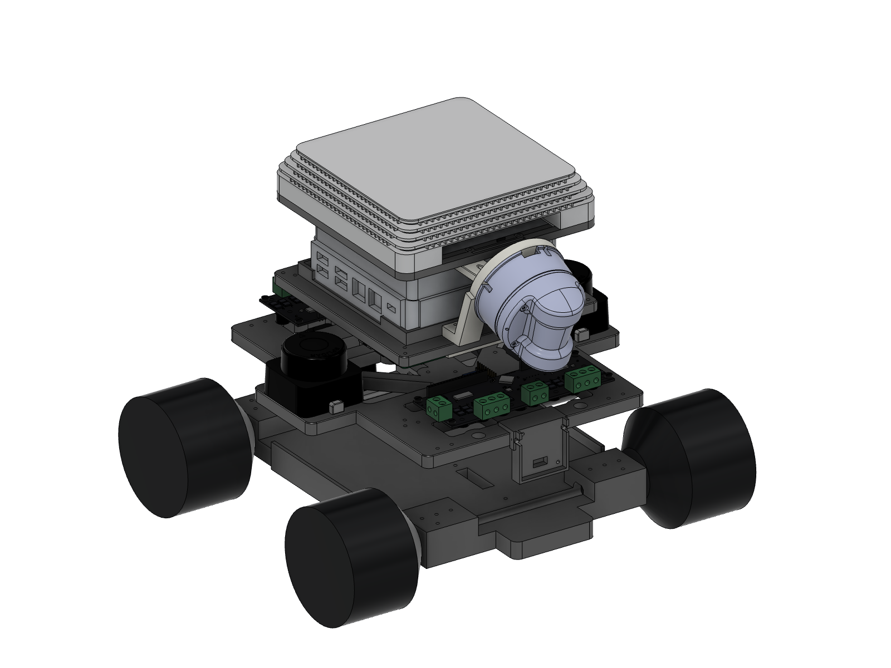
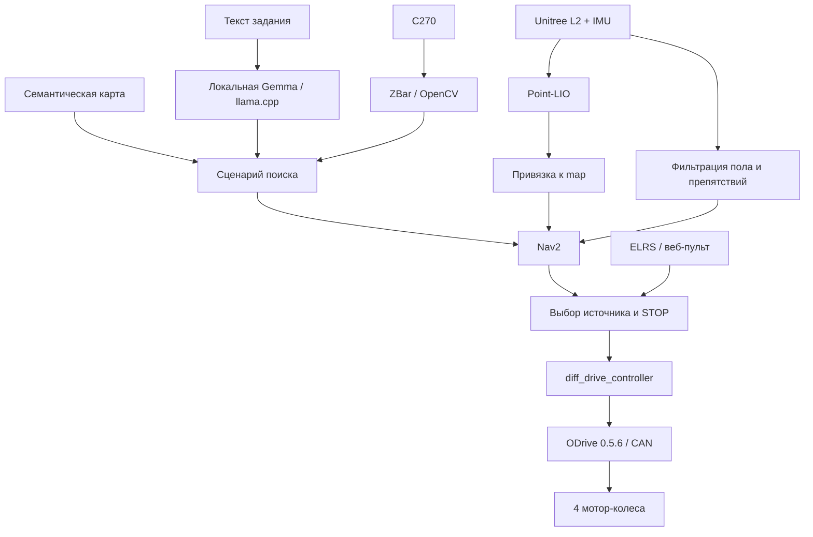
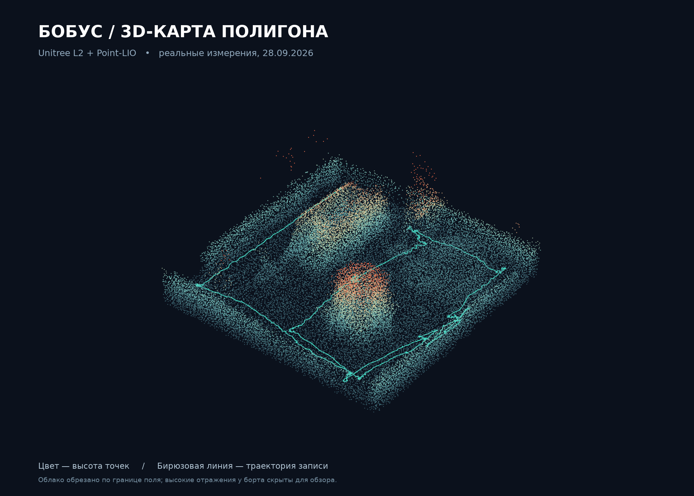
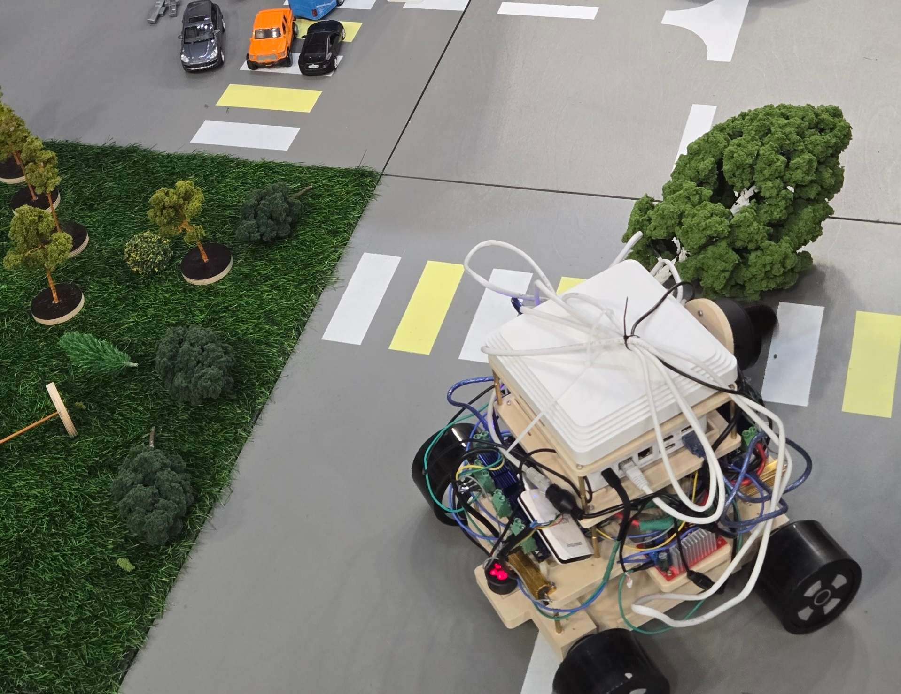

# Бобус · Misis Akies

<p align="center">
  
</p>


Четырёхколёсный робот для хакатона **«Эвакуация»**: локальная языковая модель понимает текст задания, Nav2 ведёт платформу к точкам осмотра, камера ищет и считывает QR-код условного пострадавшего.

**Команда Misis Akies заняла 1-е место — 340 баллов** на этапе «Кубок РТК Высшая лига: Фестиваль „Победа“» в Раменском, 27–29 сентября 2026 года. [Официальные результаты](https://t.me/cuprtc/2383) · [Анонс этапа и задачи](https://regions.ru/ramenskoe/obshchestvo/studentov-i-shkolnikov-zovut-na-kubok-rtk-v-ramenskom-kak-zaregistrirovatsja).

В репозитории — код робота, настройки привода и навигации, веб-панель и инструменты для испытаний.

## Платформа

**4 мотор-колеса × 600 Вт · 2 ODrive · 3D-лидар Unitree L2**



*Модель Бобуса в Autodesk Fusion.*

| Привод | Управление | Восприятие |
| --- | --- | --- |
| Четыре мотор-колеса Ø90 мм, заявленная мощность по 600 Вт | Две двухосевые ODrive 3.6, CAN и ROS 2 | Объёмное облако Unitree L2, IMU и камеры |

Каждая ODrive управляет парой колёс. По данным лидара строим карту, определяем положение робота и обнаруживаем препятствия. Локальная языковая модель работает на бортовом мини-ПК.

## Задача

За пять минут робот должен понять текстовое описание места, найти пострадавшего на макете города, остановиться рядом, считать QR с его состоянием и вернуться на старт. На поле есть здания, мосты, пруд и переставляемые препятствия. Физически перевозить пострадавшего не требуется.

## Команда

| Участник | Что делали | GitHub |
| --- | --- | --- |
| Баранов Андрей | Семантическая разметка карты полигона, объекты и точки осмотра | — |
| Епифанцев Тарас | Сборка робота, настройка моторов и контроллеров | [2taras](https://github.com/2taras) |
| Саргин Ярослав | Навигация, локальная модель, веб-панель и испытания | [ropraname](https://github.com/ropraname) |

Материалы для публикации и перезачёта: [анкета](docs/publication.md).

## Что умеет робот

- Управление четырьмя мотор-колёсами через CAN: адаптированный `odrive_ros2_control` для ODrive 3.6 / прошивки 0.5.6 и штатный `diff_drive_controller`.
- URDF, колёсная одометрия и локализация по Unitree L2 / Point-LIO; начальная привязка к сохранённой карте вручную или через ICP.
- Nav2, статическая карта основных сооружений, текущие препятствия по лидару и дорожная сеть промежуточных целей.
- Семантический каталог объектов; локальная LLM выбирает объект по заданию. Координаты берутся из каталога, модель не управляет моторами напрямую.
- Фоновый поиск QR в кадрах C270, декодирование ZBar с резервным OpenCV, подтверждение на двух кадрах.
- Веб-панель: камера, 3D-облако, карта, ручная установка позы, цели и журнал попытки.
- ELRS/CRSF: ручной режим, переключение источника управления, STOP и телеметрия батареи.
- Запись датчиков, диагностические испытания, виртуальный CAN и модульные тесты без робота.

## Архитектура



| Узел | Оборудование / стек |
| --- | --- |
| Бортовое управление | Raspberry Pi, Ubuntu / ROS 2 Jazzy, Python и C++ |
| Лидарная одометрия | Unitree L2, IMU, Point-LIO |
| Привод | Две ODrive 3.6, четыре мотор-колеса по 600 Вт, Ø90 мм, Hall-датчики |
| Локальная модель | Мини-ПК Ryzen 9 7940HS, Radeon 780M, llama.cpp / Vulkan, Gemma 4 26B-A4B Q4_0 |
| Камеры | Logitech C270 на Pi; дополнительная широкоугольная USB-камера на мини-ПК |
| Навигация | Nav2, Regulated Pure Pursuit, NumPy, YAML |

В тесте на нашем мини-ПК модель выдавала около 21,6 токена/с. Для чтения QR используем C270; наведение по широкоугольной камере ещё предстоит доработать.

## Установка и запуск

### Проверка логики без робота

Для тестов нужен Python 3.12. Подключать робота не требуется:

```bash
git clone https://github.com/ropraname/mrbobus.git
cd mrbobus
python3 -m venv .venv
source .venv/bin/activate
pip install -r requirements-dev.txt
bash tools/test_offline.sh
```

### Сборка ROS 2

Окружение: Ubuntu 24.04, установленный ROS 2 Jazzy и настроенный `rosdep`.

```bash
sudo apt install python3-colcon-common-extensions python3-rosdep \
  ros-jazzy-ros2-control ros-jazzy-ros2-controllers ros-jazzy-xacro \
  ros-jazzy-navigation2 ros-jazzy-nav2-bringup \
  python3-opencv python3-numpy python3-scipy python3-yaml python3-pyzbar ffmpeg
source /opt/ros/jazzy/setup.bash
rosdep install --from-paths src/robot_base src/mrbobus_bringup src/vendor --ignore-src -r -y
colcon build --symlink-install --packages-select robot_base odrive_base odrive_ros2_control mrbobus_bringup
source install/setup.bash
```

Point-LIO собирается отдельно: [настройка и измерения LIO](docs/lio.md), [`tools/setup_lio.sh`](tools/setup_lio.sh). Драйвер Unitree L2, веса модели, карты NPZ/PGM и записи датчиков не входят в репозиторий. Семантическая разметка и генератор статической карты включены; облако для ICP требуется получить отдельно.

### Стенд и развёртывание

Настройка виртуального CAN и сервисов описана в [инструкции по запуску](docs/deployment.md). Перед установкой на другой компьютер замените пути и адреса в `deploy/` на свои.

На реальном CAN должен работать **один управляющий процесс**. Не запускайте старый `robot_base` одновременно с `mrbobus-control`. Launch привода по умолчанию использует `vcan0`, стендовый профиль и неактивный контроллер движения.

## Структура

```text
src/
  robot_base/          # исходный привод, общая логика и тесты
  mrbobus_bringup/     # ros2_control, URDF и профили привода
  mrbobus_console/     # веб-панель, Nav2, карта, QR и сценарий миссии
  mrbobus_lio/         # конфигурация и запуск Point-LIO
  vendor/             # адаптированная часть ros_odrive + лицензия upstream
deploy/               # systemd, DDS, LIO/ODrive patches, локальная модель
tools/                # диагностика, записи, генерация карт и тесты
docs/                 # геометрия, результаты проверок и документация
```

## Демонстрация и результат

### Поле глазами 3D-лидара



Карта, которую записали во время подготовки 28 сентября с Unitree L2 и Point-LIO. Цвет показывает высоту точек, бирюзовая линия — путь робота. Для наглядности убрали точки за пределами поля и высокие отражения у бортов. [Вид сверху](docs/media/field-map.png) · [Скрипт визуализации](tools/render_field_3d.py).

### На полигоне

<p align="center">
  
</p>

### Результат и дальнейшие планы

На соревнованиях заняли [1-е место с результатом 340 баллов](https://t.me/cuprtc/2383). На поле отладили движение, объезд зданий и чтение QR.

Дальше хотим улучшить повторную локализацию, поиск со всех сторон здания и возврат на старт при перекрытом маршруте. Настройки и разбор заездов ведём в [журнале разработки](docs/status.md).

## Разработка и лицензии

[Как вносить изменения](CONTRIBUTING.md) · [Аппаратные правила](AGENTS.md) · [Лицензии компонентов](NOTICE.md).

Код проекта распространяется по Apache-2.0, компоненты `robot_base` и `ros_odrive` — по MIT. Лицензии внешних моделей и библиотек указаны в [NOTICE.md](NOTICE.md).
